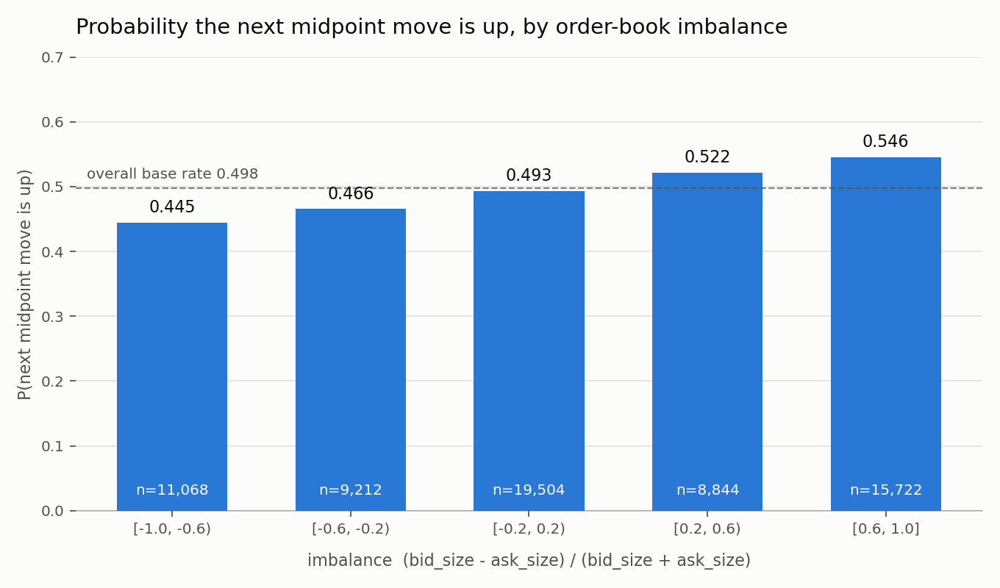

# C++23 Limit Order Book & Matching Engine

A price-time-priority limit order book and matching engine in C++, plus two
independent pieces of measurement:

1. a **synthetic throughput benchmark** of the C++ engine, and
2. a **historical microstructure analysis** of real NASDAQ-derived market data.

These two are separate exercises and are reported separately. The benchmark says
nothing about the historical data, and the historical analysis does not run
through the C++ engine.

## Build & run

```bash
cmake -S . -B build-release -DCMAKE_BUILD_TYPE=Release
cmake --build build-release -j
./build-release/orderbook_tests    # correctness
./build-release/orderbook_bench    # synthetic throughput benchmark
```

## Synthetic matching-engine benchmark

`bench/benchmark.cpp` replays a **generated** mixed workload against the engine:
1,000,000 commands built from 100,000 blocks of 7 limit submissions and 3
guaranteed-valid cancellations, with two deliberate crossing pairs per block. It
runs 5 timed passes after a warm-up and reports the median.

Measured on an Apple M4 Pro, Release (`-O3`):

| metric | value |
|---|---|
| median throughput | **18.3 M commands/sec** |
| commands per run | 1,000,000 |
| fills | 200,000 |
| executed volume | 10,109,700 |
| cancellations | 300,000 |

This workload is **synthetic**. It is a deterministic stress test of the engine's
data structures, not a replay of real market activity and not a claim about
performance under any exchange's real message mix.

## LOBSTER historical analysis

### Data

`data/lobster/` holds the free LOBSTER AAPL Level 1 sample
([lobsterdata.com](https://lobsterdata.com/info/DataSamples.php)), which LOBSTER
reconstructs from **NASDAQ Historical TotalView-ITCH**. The sample used here is
AAPL, 2012-06-21, 09:30–16:00.

This project reads LOBSTER's already-reconstructed CSVs. It does **not** parse
raw ITCH, does not reconstruct the Nasdaq book itself, and does not reproduce
Nasdaq's matching behaviour.

Each sample is a paired message file (`time, event_type, order_id, size, price,
direction`) and orderbook file (`ask_price, ask_size, bid_price, bid_size`) with
one orderbook row per message row. Prices are stored as dollar price × 10,000;
the analysis works in those integer units and converts to dollars only for
human-readable output.

If the CSVs are missing, the script exits with instructions on where to put them.

### Method

```bash
pip install -r analysis/requirements.txt
python3 analysis/analyze_lobster.py
```

For every book state the script computes

- `spread = ask_price - bid_price`
- `midpoint = (ask_price + bid_price) / 2`
- `imbalance = (bid_size - ask_size) / (bid_size + ask_size)`

The midpoint is unchanged across long runs of consecutive messages, so treating
every row as an observation would count thousands of near-identical states from
one unchanged-midpoint interval as independent evidence. Instead the series is
split into consecutive **constant-midpoint intervals**, and:

- one observation is taken per interval — the **first** book state in it;
- it is labelled `next_move_up = 1` if the **next** interval's midpoint is
  higher, otherwise `0`;
- the final interval is dropped, since it has no following midpoint move.

Observations are then bucketed by imbalance into `[-1.0, -0.6)`, `[-0.6, -0.2)`,
`[-0.2, 0.2)`, `[0.2, 0.6)`, `[0.6, 1.0]`, and the up-move rate is reported per
bucket. Because every interval boundary is by construction a midpoint change,
`P(down) = 1 - P(up)`.

### Result

From 118,497 raw rows, 64,350 constant-midpoint intervals are used (no rows had
an empty side). The overall up-move base rate is 0.4978.



| imbalance bucket | observations | P(next move up) | P(next move down) |
|---|---:|---:|---:|
| [-1.0, -0.6) | 11,068 | 0.4448 | 0.5552 |
| [-0.6, -0.2) | 9,212 | 0.4659 | 0.5341 |
| [-0.2, 0.2) | 19,504 | 0.4933 | 0.5067 |
| [0.2, 0.6) | 8,844 | 0.5219 | 0.4781 |
| [0.6, 1.0] | 15,722 | 0.5457 | 0.4543 |

Full output: [`results/imbalance_next_move.csv`](results/imbalance_next_move.csv).

The up-move rate increases monotonically with imbalance: a bid-heavy book
(imbalance ≥ 0.6) is followed by an upward midpoint move 54.6% of the time,
versus 44.5% for an ask-heavy book. The spread between the extreme buckets is
about 10 percentage points around a 49.8% base rate.

### Limitations

- **One sample period, one ticker.** A single AAPL trading day in 2012. Nothing
  here establishes that the relationship holds for other names, other days, or
  the current market.
- **Descriptive association, not a strategy.** This is a conditional frequency,
  not a backtest. It ignores transaction costs, the spread, queue position, fill
  probability, and adverse selection — a signal of this size at Level 1 is well
  inside the costs of acting on it.
- **Level 1 only.** Imbalance is computed from top-of-book sizes; depth beyond
  the touch is not used.
- **Not causal.** Imbalance and the subsequent move can both be driven by the
  same underlying order flow.
